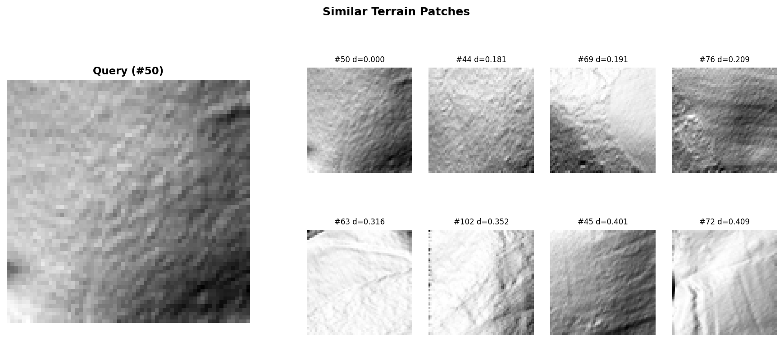

# terravector

Terrain patch similarity search using decomposition-based embeddings and HNSW indexing.

## Overview

terravector converts Digital Elevation Models (DEMs) into searchable vector embeddings. Each terrain patch gets a "fingerprint" based on how different signal decomposition methods respond to it. An HNSW index enables O(log N) similarity queries across millions of patches.

**Use cases:**
- Find all terrain patches similar to a known feature
- Discover anomalies that don't match any known pattern
- Transfer terrain signatures across different geographic regions
- Rapid terrain classification without manual labeling

## Installation

```bash
git clone https://github.com/bshepp/terravector.git
cd terravector
pip install -r requirements.txt
```

## Quick Start

```bash
# Build index from a DEM
python cli.py build path/to/dem.npy --patch-size 64 --output terrain.idx

# Query for similar patches (text output)
python cli.py query terrain.idx --patch 42 --k 10

# Query with visualization
python cli.py query terrain.idx --patch 42 --k 8 --visualize similar.png

# Query by pixel coordinates
python cli.py query terrain.idx --coords 500,200 --k 10 --visualize results.png

# Index info
python cli.py info terrain.idx
```

## Example Output

Query a patch and find similar terrain from anywhere in the DEM:



The query patch (left) is compared against all indexed patches. Results show the most similar terrain ordered by cosine distance on decomposition signatures.

## How It Works

1. **Tiling**: DEM is divided into patches (default 64×64 pixels)
2. **Decomposition**: Each patch is analyzed with 6 methods:
   - Gaussian (low-pass smoothing)
   - Bilateral (edge-preserving smoothing)
   - Wavelet DWT (multi-scale decomposition)
   - Morphological opening (shape-based filtering)
   - Top-hat transform (small feature extraction)
   - Polynomial surface fitting (trend removal)
3. **Embedding**: Statistics of each decomposition residual (mean, std, energy, entropy, range, median) form a 36-dimensional feature vector
4. **Indexing**: HNSW graph enables approximate nearest neighbor search in O(log N) time

## Project Structure

```
terravector/
├── cli.py                     # Command-line interface
├── src/
│   ├── tiling.py              # DEM → patches
│   ├── decomposition/         # Signal decomposition methods
│   │   └── methods.py         # 6 core decomposition algorithms
│   ├── embedding.py           # Patch → 36-dim feature vector
│   ├── index.py               # HNSW index (nmslib)
│   ├── visualization.py       # Query result visualization
│   └── utils/
│       └── io.py              # DEM loading, index persistence
├── data/                      # Test data and outputs
├── requirements.txt
└── LICENSE                    # Apache 2.0
```

## Requirements

- Python 3.8+
- numpy, scipy, scikit-image, PyWavelets, opencv-python
- nmslib (HNSW implementation)
- matplotlib (visualization)

## Inspiration

This project was inspired by [centamori's HNSW implementation in PHP](https://github.com/centamiv/vektor) — the realization that HNSW's hierarchical navigation could work for terrain if "vectors" were decomposition signatures rather than text embeddings.

The decomposition methods come from [RESIDUALS](https://github.com/bshepp/RESIDUALS), a framework for systematic feature detection in LiDAR DEMs.

## License

Apache 2.0

## Citation

```bibtex
@software{terravector2025,
  author = {Shepp, B.},
  title = {terravector: Terrain Patch Similarity Search},
  year = {2025},
  url = {https://github.com/bshepp/terravector}
}
```
