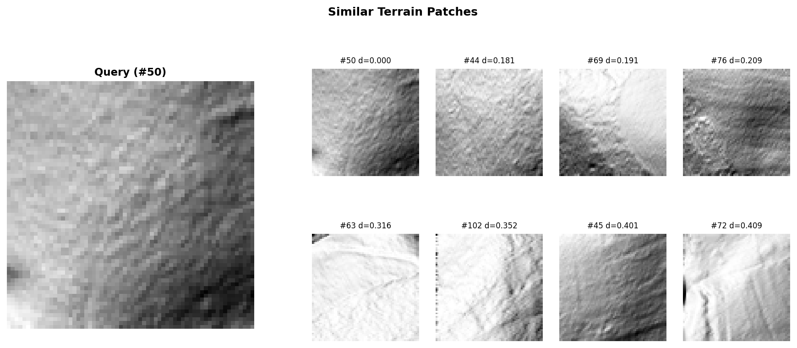

# terravector

Terrain patch similarity search using decomposition-based embeddings and HNSW indexing.

> **Note:** This is an exploratory project and very much a work in progress. Built in an afternoon after reading about HNSW vector search and realizing it could apply to terrain analysis. Expect rough edges, evolving APIs, and experimental features. Feedback and contributions welcome.

## Overview

terravector converts Digital Elevation Models (DEMs) into searchable vector embeddings. Each terrain patch gets a "fingerprint" based on how different signal decomposition methods respond to it. An HNSW index enables O(log N) similarity queries across millions of patches.

**Use cases:**
- Find all terrain patches similar to a known feature
- Discover anomalies that don't match any known pattern
- Transfer terrain signatures across different geographic regions
- Rapid terrain classification without manual labeling

## Installation

```bash
git clone https://github.com/bshepp/terravector.git
cd terravector
pip install -r requirements.txt
```

## Quick Start

### Desktop Viewer (Recommended for Scientists)

Launch the napari-based desktop viewer for smooth pan/zoom and advanced overlays:

```bash
python viewer.py path/to/dem.npy path/to/index.idx
```

**Features:**
- **Click to Query**: Click any tile to find similar patches
- **Box Overlay**: Colored rectangles around similar tiles (green = query, orange = results)
- **Heatmap**: Similarity scores as color intensity (blue → red)
- **Fade Effect**: Dim non-matching tiles to highlight results
- **Threshold Slider**: Filter results by distance
- **GPU-accelerated**: Smooth pan/zoom even on large DEMs

### Web UI

Launch the Gradio web interface for browser-based exploration:

```bash
python app.py
```

This opens a browser at `http://127.0.0.1:7860` where you can:
- Load DEM files (`.npy` or `.tif`)
- Build indices with configurable signature types
- Click on the terrain map to find similar patches
- View results in an interactive gallery

### Command Line

```bash
# Build index from a DEM (default: decomposition signatures)
python cli.py build path/to/dem.npy --patch-size 64 --output terrain.idx

# Build with different signature types
python cli.py build dem.npy --config classic --output classic.idx     # geomorphometric only
python cli.py build dem.npy --config hybrid --output hybrid.idx       # all features combined
python cli.py build dem.npy --config configs/custom.yaml --output custom.idx  # custom YAML

# Query for similar patches (text output)
python cli.py query terrain.idx --patch 42 --k 10

# Query with visualization
python cli.py query terrain.idx --patch 42 --k 8 --visualize similar.png

# Query by pixel coordinates
python cli.py query terrain.idx --coords 500,200 --k 10 --visualize results.png

# Index info
python cli.py info terrain.idx
```

## Example Output

Query a patch and find similar terrain from anywhere in the DEM:



The query patch (left) is compared against all indexed patches. Results show the most similar terrain ordered by cosine distance on decomposition signatures.

## How It Works

1. **Tiling**: DEM is divided into patches (default 64×64 pixels)
2. **Feature Extraction**: Each patch is analyzed with configurable signature types
3. **Embedding**: Statistics from each feature type are concatenated into a feature vector
4. **Indexing**: HNSW graph enables approximate nearest neighbor search in O(log N) time

## Signature Types

terravector supports five signature types that can be used individually or combined:

### Decomposition (default)
Signal processing residual analysis - the original method:
- **Gaussian**: Low-pass smoothing
- **Bilateral**: Edge-preserving smoothing
- **Wavelet DWT**: Multi-scale decomposition
- **Morphological**: Shape-based filtering
- **Top-hat**: Small feature extraction
- **Polynomial**: Trend surface removal

Each method produces 6 statistics → **36 dimensions**

### Geomorphometric
Classic terrain derivatives used in traditional GIS analysis:
- **Slope**: Gradient magnitude (steepness)
- **Aspect**: Gradient direction
- **Curvature**: Surface bending (ridges/valleys)
- **TPI**: Topographic Position Index
- **TRI**: Terrain Ruggedness Index
- **Roughness**: Local elevation variance

Each feature produces 6 statistics → **36 dimensions**

### Texture
Image texture analysis applied to terrain:
- **GLCM**: Gray-Level Co-occurrence Matrix (6 properties)
- **LBP**: Local Binary Patterns (10 histogram statistics)

→ **16 dimensions**

### Directional FFT (Spectral)
Frequency analysis at multiple angles through the 2D FFT:
- Captures oriented frequency content for linear feature detection
- Detects drainage networks, ridges, agricultural patterns, roads
- Configurable angles (default: 0°, 45°, 90°, 135°)
- Per-angle statistics: energy, low/high frequency ratio, peak frequency, spectral centroid/spread

4 angles × 6 stats → **24 dimensions** (or 48 with 8 angles)

### Presets

| Preset | Signature Types | Dimensions | Use Case |
|--------|-----------------|------------|----------|
| `default` | Decomposition only | 36 | Original behavior |
| `classic` | Geomorphometric only | 36 | Traditional terrain analysis |
| `texture` | Texture only | 16 | Surface pattern matching |
| `hybrid` | All three | 88 | Maximum discrimination |
| `minimal` | Reduced decomp + geomorph | 24 | Fast computation |
| `residuals` | Decomp × Upsamp + Analysis | 320 | DIVERGE-style rich features |
| `spectral` | Directional FFT (8 angles) | 48 | Oriented feature detection |
| `spectral_hybrid` | Decomposition + FFT | 60 | Combined spatial + spectral |

### Residuals signature: optional amplification stages

The `residuals` family supports two experimental stages on top of the base
decomposition × upsampling grid. Both are off by default and toggled via
the `residuals:` section in the YAML config (see `src/config.py` for full param list):

- **`bidirectional: true`** — for each (decomp, upsamp) pair, also compute
  the reverse path (up then down) and emit the analysis of the (A − B)
  asymmetry as an extra slot. Doubles the residuals slice (320 → 640 d
  on the default 4×4 grid).
- **`turing_intermediate: true`** — pass each round-trip output through
  `turing_iterations` Gray-Scott reaction-diffusion steps before analysis.
  Subtle textural differences settle into discretely different attractor
  patterns, improving downstream HNSW separability at a compute cost.

Run `python compare_separability.py` to sweep these variants against the
vanilla residuals signature and measure within-tile vs across-tile cosine
distance — i.e. whether the amplification actually pulls similar terrain
together and pushes dissimilar terrain apart.

### Custom Configuration

Create a YAML file in `configs/` for fine-grained control:

```yaml
signature:
  decomposition:
    enabled: true
    methods: [gaussian, bilateral, wavelet_dwt]
  geomorphometric:
    enabled: true
    features: [slope, curvature, tpi]
  texture:
    enabled: false

normalize: true
space: cosinesimil
```

## Web UI

The Gradio interface provides an interactive way to explore terrain similarity:

```bash
python app.py
```

**Features:**
- **Load DEM**: Enter path to `.npy` or `.tif` elevation file
- **Load Index**: Open a previously saved index (with its source DEM)
- **Build Index**: Configure signature preset and patch size, then build
- **Click to Query**: Click anywhere on the hillshade map to find similar patches
- **Query by ID**: Enter a specific patch ID for targeted queries
- **Random Query**: Explore the index with random patch selections
- **Results Gallery**: Visual grid showing similar patches ordered by distance
- **Save Index**: Persist your index for later use

The UI runs locally — your data never leaves your machine.

## REST API

`api.py` exposes the loaded index as a FastAPI service for integration with
external tools (QGIS plugin, web frontends, scripts).

```bash
# Point at an index built by build_county_index.py
TERRAVECTOR_INDEX=data/licking_county/licking_county.idx \
    uvicorn api:app --reload --host 127.0.0.1 --port 8000
```

Interactive Swagger docs at `http://127.0.0.1:8000/docs`.

**Endpoints:**
- `GET  /health` — index/bridge readiness
- `GET  /info` — index stats, county bounds (both State Plane and WGS84), signature types
- `POST /query/by-id` — `{patch_id, k}` → similar patches enriched with bbox + center
- `POST /query/by-coords` — `{lon, lat, k}` or `{x, y, crs, k}` → resolves to a patch, then queries

Spatial endpoints return results with both State Plane (EPSG:3735, ft) and
WGS84 bounding boxes when the index ships with a `*.corpus.json` sidecar.
Without one, the bridge endpoints respond 501.

Quick sanity check that a point of interest is inside your corpus
(no full index load required):

```bash
python check_coords.py --lat 40.0279 --lon -82.4590 \
    --corpus data/licking_county/licking_county.corpus.json
```

## Building the Licking County corpus

`build_county_index.py` is the production pipeline that turns the RESIDUALS
sibling project's 200 cached county tiles into a single unified HNSW index
(~870K patches at the default `residuals` preset).

```bash
python build_county_index.py --dry-run    # plan only
python build_county_index.py              # full build (~hours)
python build_county_index.py --resume     # skip already-checkpointed tiles
```

The build is **checkpointed per tile** under `data/licking_county/checkpoints/`
(gitignored), so it's safe to interrupt and resume. A per-tile sidecar
`*_diagnostics.json` records any (decomp, upsamp) pairs that failed silently
during embedding, and the final `*.corpus.json` rolls those failures up
across tiles — useful for spotting a decomposition method that's broken
in production before the index is opaque.

The path constants at the top of `build_county_index.py` are currently
hardcoded for a Windows workstation; if you're running elsewhere, edit
`COUNTY_TILES_DIR`, `OUTPUT_DIR`, and `CONFIG_PATH`.

## Project Structure

```
terravector/
├── app.py                     # Gradio web UI
├── api.py                     # FastAPI REST service
├── viewer.py                  # Napari desktop viewer
├── cli.py                     # Command-line interface
├── build_county_index.py      # Licking County corpus pipeline (checkpointed)
├── compare_separability.py    # Sweep residuals signature variants
├── check_coords.py            # Quick "is this point in the corpus?" check
├── src/
│   ├── config.py              # YAML config parsing
│   ├── coords.py              # WGS84 ↔ State Plane ↔ patch ID bridge
│   ├── tiling.py              # DEM → patches
│   ├── decomposition/         # Signal decomposition methods
│   │   ├── methods.py         # Core decomposition algorithms
│   │   ├── methods_extended.py # Extended methods (from DIVERGE)
│   │   └── registry.py        # Method registration system
│   ├── upsampling/            # Resolution upsampling methods
│   │   ├── methods.py         # Core upsampling algorithms
│   │   ├── methods_extended.py # Extended methods
│   │   └── registry.py        # Method registration system
│   ├── features/              # Feature extractors
│   │   ├── geomorphometric.py # Slope, curvature, TPI, etc.
│   │   ├── texture.py         # GLCM, LBP
│   │   ├── analysis.py        # Rich feature analysis
│   │   └── directional_fft.py # Spectral analysis at angles
│   ├── embedding.py           # Patch → feature vector
│   ├── index.py               # HNSW index (nmslib)
│   ├── visualization.py       # Query result visualization
│   ├── ui/                    # Gradio UI components
│   │   ├── state.py           # Application state management
│   │   └── components.py      # Visualization helpers
│   ├── viewer/                # Napari desktop viewer
│   │   ├── app.py             # Main viewer class
│   │   ├── layers.py          # Overlay layer generators
│   │   └── widgets.py         # Qt control widgets
│   └── utils/
│       ├── io.py              # DEM loading, index persistence
│       └── turing.py          # Gray-Scott amplifier for residuals signature
├── configs/                   # Signature configurations
│   ├── default.yaml
│   ├── classic.yaml
│   ├── hybrid.yaml
│   ├── minimal.yaml
│   ├── residuals.yaml         # DIVERGE-style decomp × upsamp
│   ├── spectral.yaml          # Directional FFT signatures
│   └── spectral_hybrid.yaml   # Combined decomposition + FFT
├── data/                      # Test data and outputs (corpus + checkpoints gitignored)
├── requirements.txt
└── LICENSE                    # Apache 2.0
```

## Requirements

- Python 3.8+
- numpy, scipy, scikit-image, PyWavelets, opencv-python
- nmslib (HNSW implementation)
- matplotlib (visualization)
- PyYAML (configuration)
- gradio (web UI)
- napari (desktop viewer — GPU-accelerated)
- fastapi + uvicorn (REST API)
- pyproj (WGS84 ↔ State Plane coordinate transforms)

## Inspiration

This project was inspired by [centamori's HNSW implementation in PHP](https://github.com/centamiv/vektor) — the realization that HNSW's hierarchical navigation could work for terrain if "vectors" were decomposition signatures rather than text embeddings.

The decomposition methods come from [RESIDUALS](https://github.com/bshepp/RESIDUALS), a framework for systematic feature detection in LiDAR DEMs.

## Roadmap

terravector is part of a layered architecture — see the full roadmap in [RESIDUALS](https://github.com/bshepp/RESIDUALS). The next steps for terravector specifically:

1. **Index the Licking County corpus** — RESIDUALS is generating 200 cached DEM tiles with SVF, openness, and multi-scale TopHat. Build the HNSW index on this corpus (~1.7M patches).
2. **QGIS plugin** — package the index + query pipeline as a GIS plugin ("Right-click → Find Similar Terrain").
3. **Modernize the index backend** — evaluate FAISS or Qdrant as replacements for nmslib.
4. **Recommendation API** — given a terrain patch, recommend the best decomposition method (see `docs/RESIDUALS_SERVICE_CONCEPT.md`).

### Architecture Principle

terravector is a pure algorithmic tool — no ML training required. Any future ML classifiers will sit as a separate layer that consumes terravector's index, not as a dependency within it.

## License

Apache 2.0

## Citation

```bibtex
@software{terravector2025,
  author = {Shepp, B.},
  title = {terravector: Terrain Patch Similarity Search},
  year = {2025},
  url = {https://github.com/bshepp/terravector}
}
```
